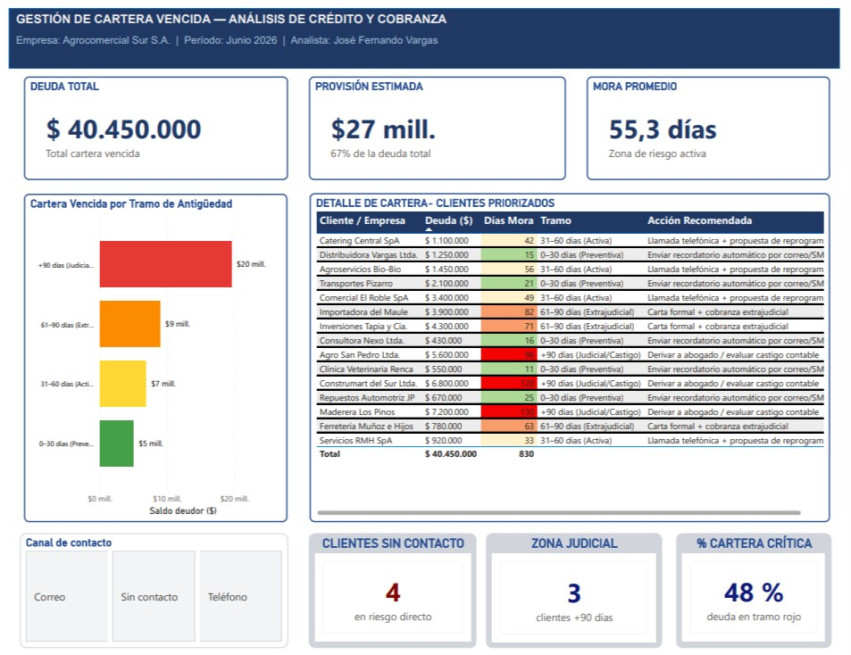

# Gestión de Cartera Vencida — SQL Server + Power BI


**Autor:** José Fernando Vargas Vallejos
**Perfil:** Ingeniero Comercial | Analista de Crédito y Cobranza
**Empresa simulada:** Agrocomercial Sur S.A.
**Período:** Junio 2026

---

## Descripción del proyecto

Proyecto de análisis de cartera vencida desarrollado con SQL Server y Power BI,
simulando el rol de analista de crédito y cobranza en una empresa comercial ficticia
(Agrocomercial Sur S.A.) con un portafolio de 15 clientes y una deuda total de $40,45M.

El flujo cubre desde la creación de la base de datos, inserción de datos del portafolio,
consultas analíticas progresivas (SELECT → JOINs → funciones de ventana), exportación
automatizada con Python y visualización en Power BI.

---

## Problema de negocio

La empresa necesita identificar, priorizar y gestionar su cartera vencida según
criterios de antigüedad de mora, nivel de riesgo y canal de contacto disponible,
aplicando criterios IFRS 9 para el cálculo de provisiones.

---

## KPIs principales del portafolio

| KPI | Valor |
|---|---|
| Deuda Total | $40.450.000 |
| Provisión Estimada | ~$27 mill. (67%) |
| Mora Promedio | 55,3 días |
| Clientes sin contacto | 4 |
| Zona Judicial | 3 clientes |
| Cartera Crítica (>90 días) | 48% de la deuda |

---

## Dashboard Power BI



---

## Estructura del proyecto

| Archivo | Descripción |
|---|---|
| `01_crear_base_datos.sql` | Creación de base de datos y tablas (Clientes, Deudas, Pagos) |
| `02_insertar_datos.sql` | Carga del portafolio ficticio de 15 clientes |
| `03_consultas_analiticas.sql` | Consultas analíticas en 4 bloques: SELECT, GROUP BY, JOINs + CASE WHEN, funciones de ventana |
| `exportar_mora_critica.py` | Script Python que exporta clientes con mora >90 días a CSV desde el portafolio Excel |
| `mora_critica_20260624.csv` | CSV generado con los 4 clientes en mora crítica |
| `Cartera Cobranza Portafolio 2026.xlsx` | Portafolio completo del período en Excel |
| `dashboard_cartera.png.jpg` | Captura del dashboard Power BI |

---

## Modelo de datos

```
Clientes (id_cliente PK, nombre, canal_contacto, zona)
    │
    ├──► Deudas (id_deuda PK, id_cliente FK, monto_deuda, fecha_vencimiento, fecha_consulta)
    │        │
    │        └──► Pagos (id_pago PK, id_deuda FK, monto_pagado, fecha_pago)
```

---

## Consultas SQL — Bloques progresivos

| Bloque | Tema | Técnicas |
|---|---|---|
| 1 | Exploración inicial | `SELECT`, `WHERE`, `ORDER BY` |
| 2 | Agregaciones | `GROUP BY`, `HAVING`, `COUNT`, `SUM`, `AVG` |
| 3 | Consulta maestra | `INNER JOIN`, `LEFT JOIN`, `CASE WHEN`, `DATEDIFF`, provisiones IFRS 9 |
| 4 | Funciones de ventana | `ROW_NUMBER()`, `SUM() OVER`, `PARTITION BY`, ranking y acumulados |

---

## Cómo ejecutar

1. Ejecutar `01_crear_base_datos.sql` en SQL Server para crear la base `CarteraVencida`
2. Ejecutar `02_insertar_datos.sql` para cargar el portafolio de 15 clientes
3. Ejecutar `03_consultas_analiticas.sql` para las consultas analíticas
4. (Opcional) Ejecutar `python exportar_mora_critica.py` para generar el CSV de mora crítica

---

## Tecnologías utilizadas

- **SQL Server** — Modelado relacional y consultas analíticas
- **Power BI** — Dashboard interactivo de gestión de cartera
- **Python** (pandas) — Automatización de exportación de datos
- **Excel** — Portafolio fuente del período
